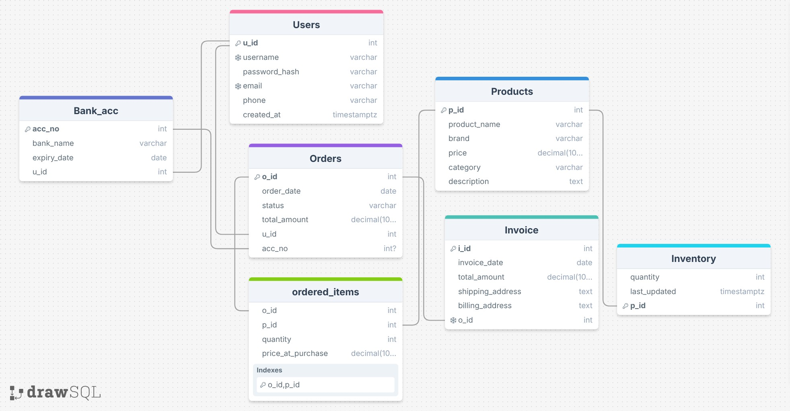

# Schema

This document outlines the tables used for the application, along with their fields, datatypes, and constraints.

## Strong Entities

### Users

**Fields:**
- `u_id` – INTEGER
- `username` – VARCHAR(255)
- `password_hash` – VARCHAR(255)
- `email` – VARCHAR(255)
- `phone` – VARCHAR(20)
- `created_at` – TIMESTAMPTZ

**Constraints:**
- Primary Key: `u_id`
- Unique: `username`
- Unique: `email`
- NOT NULL: `username`, `password_hash`, `email`, `phone`, `created_at`
### Bank_acc

**Fields:**
- `acc_no` – INTEGER
- `bank_name` – VARCHAR(255)
- `expiry_date` – DATE
- `u_id` – INTEGER

**Constraints:**
- Primary Key: `acc_no`
- Foreign Key: `u_id` → `Users(u_id)` ON DELETE CASCADE
- NOT NULL: `bank_name`, `expiry_date`, `u_id`
### Products

**Fields:**
- `p_id` – INTEGER
- `product_name` – VARCHAR(255)
- `brand` – VARCHAR(255)
- `price` – DECIMAL(10,2)
- `category` – VARCHAR(255)
- `description` – TEXT

**Constraints:**
- Primary Key: `p_id`
- CHECK: `price ≥ 0`
- NOT NULL: `product_name`, `brand`, `price`, `category`, `description`
### Orders

**Fields:**
- `o_id` – INTEGER
- `order_date` – DATE
- `status` – VARCHAR(50)
- `total_amount` – DECIMAL(10,2)
- `u_id` – INTEGER
- `acc_no` – INTEGER

**Constraints:**
- Primary Key: `o_id`
- Foreign Key: `u_id` → `Users(u_id)` ON DELETE CASCADE
- Foreign Key: `acc_no` → `Bank_acc(acc_no)` ON DELETE SET NULL
- CHECK: `status ∈ ('CREATED','PAID','SHIPPED','DELIVERED','CANCELLED')`
- CHECK: `total_amount ≥ 0`
- NOT NULL: `order_date`, `status`, `total_amount`, `u_id`
### Invoice

**Fields:**
- `i_id` – INTEGER
- `invoice_date` – DATE
- `total_amount` – DECIMAL(10,2)
- `shipping_address` – TEXT
- `billing_address` – TEXT
- `o_id` – INTEGER

**Constraints:**
- Primary Key: `i_id`
- Foreign Key: `o_id` → `Orders(o_id)` ON DELETE CASCADE
- UNIQUE: `o_id`
- CHECK: `total_amount ≥ 0`
- NOT NULL: `invoice_date`, `total_amount`, `shipping_address`, `billing_address`, `o_id`
## Weak Entities

### Inventory

**Fields:**
- `p_id` – INTEGER
- `quantity` – INTEGER
- `last_updated` – TIMESTAMPTZ

**Constraints:**
- Primary Key: `p_id`
- Foreign Key: `p_id` → `Products(p_id)` ON DELETE CASCADE
- CHECK: `quantity ≥ 0`
- NOT NULL: `quantity`, `last_updated`
## Relations

### ordered_items

**Fields:**
- `o_id` – INTEGER
- `p_id` – INTEGER
- `quantity` – INTEGER
- `price_at_purchase` – DECIMAL(10,2)

**Constraints:**
- Primary Key: `(o_id, p_id)`
- Foreign Key: `o_id` → `Orders(o_id)` ON DELETE CASCADE
- Foreign Key: `p_id` → `Products(p_id)` ON DELETE CASCADE
- CHECK: `quantity > 0`
- CHECK: `price_at_purchase ≥ 0`
- NOT NULL: `o_id`, `p_id`, `quantity`, `price_at_purchase`